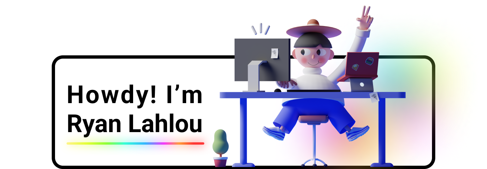

  

 

<h5 align="center">
  <code><a href="https://www.linkedin.com/in/lryanle/" title="LinkedIn Profile"> LinkedIn</a></code>
  <code><a href="https://www.ryanlahlou.com" title="Personal Website"> Personal Website</a></code>
  <code><a href="mailto:contact@ryanlahlou.com" title="Email"> Email Me</a></code>
</h5>

  👨‍💻 Aspiring Software Engineer & 🧑‍🔬 Undergraduate Researcher
   
  🇻🇳 Vietnamese / 🇲🇦 Moroccan
   
  ✈️ OKC -> DFW

 

  <b>Technologies I use(d)</b>
    
  
  
  
  
  
  
  
  
  
  
  
  
  
  
  
  
  
  
  
  
  
  
  
  
  
  
  
  
  
  
  
  
  
  
  
  
  
  
  
  
  
  
  
  
  
  
  
  
  
  
  
  
  
  
  
  
  
  
  
  
  
  
  
  
  
  
  
  
  
  
  
  
  
  
  
  
  
  
  
  
  
  
  
  
  
  
  
  
  
  
  
  
  
  
  
  
  
  
  
  
  
  
  
  
  
  
  
  
  
  
  
  
  
  
  

 

 

  

    
      
  

